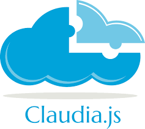
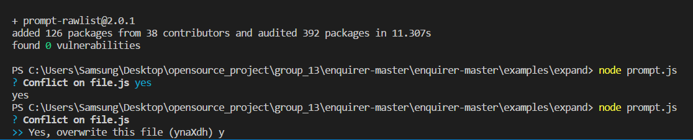
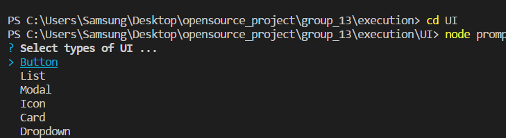
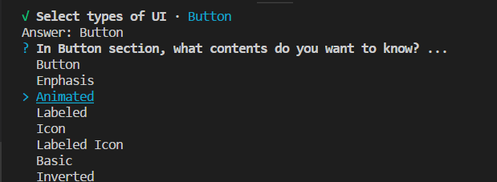
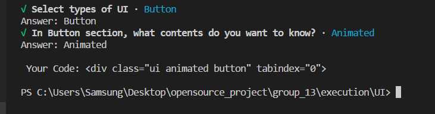

# **Team 13**
-----------------------

## Project Name :triangular_flag_on_post:
> Contribution for 
**stylish**
CLI prompts and Utilization for Claudia and SemanticUI  

## What is "Enquirer"?

`Enquirer.js`

> **Stylish CLI prompts that are user-friendly, intuitive and easy to create. Prompts should be more like conversations than inquisitions.** 

> 사용자에게 친숙하고 좀 더 시각적인 CLI prompt 환경을 조성 해주는 Opensource

## What is "Claudia"?

`Claudia.js`

> Claudia makes it easy to deploy Node.js projects to AWS Lambda and API Gateway. It automates all the error-prone deployment and configuration tasks, and sets everything up the way JavaScript developers expect out of the box. This means that you can get started with Lambda and API Gateway easily, and focus on solving important business problems instead of dealing with AWS deployment workflows

## What is "Semantic UI"?

> **User Interface is the language of the web**

> Design Beautiful Websites Quickly. Semantic is a development framework that helps create beautiful, responsive layouts using human-friendly HTML.

![semantic UI] (img/semantic ui.PNG)

## Purpose and Issue

:round_pushpin: **Enquire.js의 부족한 사용법**

* Enquirer을 사용할 때 일부 기능에서 단축키에 대한 설명이 부족하여 사용하기 힘든 점이 있음

* 일부 기능들에 대한 자세한 설명이 나와있지 않아 직접 시도해 가면서 사용방법을 인지해야 한다.

:round_pushpin: **비효율적으로 운영되는 Enquirer 오픈소스**

* Enquire관련 오픈소스들이 산발적으로 분산되어있음 

* 사용할때마다 npm install해야한다

* *Enquire에 자주 사용되지 않는 불필요한 기능들이 있음

     ex) survey와 같은 기능은 실질적으로 prompt창에서 잘 사용되지 않음

:round_pushpin: **개발할 때마다 Semantic UI 홈페이지에 들어가서 code를 찾아 사용해야하는 번거러움**

* 개발 초보자의 경우 Semantic UI code를 외우기 힘들며, 다양한 UI opensource가 있기때문에 코드를 일일히 찾아서 복사하여 사용해야한다

* 숙력된 사용자의 경우도 많이 쓰는 UI의 코드를 외우지는 못하기 때문에 일일이 찾아가야하는 번거로움이 존재한다

:round_pushpin: **Claudia.js를 사용할때, create명령어 사용의 어려움**

* Claudia를 사용하려면 여러 옵션들을 적어서 설정하는데 일일이 작성해야하는 문제도 있으며, 타이포(typo)의 문제가 있다.

    ex) claudia create --option us-east-1 --name awesome-microservice

## Solution and Expectation

:round_pushpin: **Enquirer을 직접 사용하면서 사용자에게 필요한 기능들을 한글버전의 README 파일로 작성**

* Enquirer 사용과정에서 일부 기능이 제대로 작동하지 않아서 오류를 수정한 후 push함

* 사용과정에서 sort와 같은 기능에서 sorting 하는 단축키가 prompt상에 설명 되있지 않아서 이에 대한 단축키를 표시함

    ex) sort시 shift + 방향키를 눌러 item들을 변경 가능함

* 한글버전으로 Enquirer의 사용방법을 작성하여 사용자들이 쉽게 이해할 수있도록 작상함

:round_pushpin: **CLI prompt관련 오픈소스가 다양하게 깃허브에 올라와 있지만, 단편적인 기능들도 npm install해야되는 불편함이 있다**

* 다양한 오픈소스 중 prompt를 사용하는 사용자기 필요로 할만한 오픈소스 기능을 병합함 

    ex) enquirer/expand - git 사용시 conflict가 발생할때, conflict 발생 원인을 알려주는 기능

:round_pushpin: **Enquirer 기능을 적용하여 Sematic UI code를 사이트에 들어가서 찾아보지 않도록 도와주는 기능을 추가함**

* Enquirer의 select기능을 활용하여 자신이 원하는 Sematic UI를 prompt에서 사용자가 선택하여, 코드까지 출력해주는 기능을 추가함

:round_pushpin: **Enquirer 기능을 활용하여 Claudia의 긴 명령어를 사용자가 암기하지 않고 쉽게 제시된 list에서 선택하게 도와주는 기능으로 업그레이드함**

## How to use Open Source

1. Enquirer.js의 모든 기능에 대해 설명하는 md 파일이 부재하기 때문에 각 기능을 직접 사용해본 후코드와 함께 기능을 자세히 설명해주는 md파일을 만든다.

2. 오픈소스 `Enquirer.js`를 사용하여 `claudia.js`에 있는 코멘드의 UI를 업데이트시킨다.

3. 오픈소스 `Enquirer.js`를 사용하여 `Semantic UI`의 사용을 쉽게 한다.

## To do
- [x] `Enquirer` -  에러 수정 
- [x] `Enquirer` -  사용법 작성
- [x] `Enquirer` - 다른 오픈 소스와 결합하여 새로운 기능 추가 
- [ ] `Claudia` & `Enquirer` - enquirer기능을 이용하여 claudia 사용을 좀 더 편리하게 수정
*(editing)*
- [x] Semantic UI & `Enquirer` - enquirer기능을 이용하여 UI code search를 좀 더 편리하게 사용하도록 새로운 기능 생성 

## Team Member :busts_in_silhouette:

NAME | `Enquirer.js` 사용법 | ROLE | User name
------|---------------------|------|--------------------------------------
안평열 |multiselct, number, numeral, password, scale | `Enquirer.js` 사용법 작성   README 작성   Semantic UI 기능 코딩 기본코드 작성 | @ahnppeng   @pyungryulahn1009
조경선 | select, snippet, sort, string, survey | `Enquirer.js` 사용법 작성  README 작성   Semantic UI 기능 코딩 기본코드 작성 | @summer213
임익화 | form, fun, input, invisible, list | `Enquirer.js` 사용법 작성 Semantic UI 기능 코딩  | @lih
이주연 |autocomplete, boolean, confirm, editable, enquirer | `Enquirer.js` 사용법 작성 Semantic UI 기능 코딩  | @jooyeon 

## Open Source List

`Enquirer.js`

> https://github.com/enquirer/enquirer

`Claudia.js`

> https://github.com/claudiajs/claudia

`Semantic UI`

> https://semantic-ui.com/

## License 
* Enquirer/expand: Copyright © 2017, Jon Schlinkert. Released under the MIT License.

* Semantic UI: Free & Open Source (MIT)

* Claudia: The MIT License (MIT)
Copyright (c) 2016 Gojko Adzic
Permission is hereby granted, free of charge, to any person obtaining a copy of this software and associated documentation files (the "Software"), to deal in the Software without restriction, including without limitation the rights to use, copy, modify, merge, publish, distribute, sublicense, and/or sell copies of the Software, and to permit persons to whom the Software is furnished to do so, subject to the following conditions:
The above copyright notice and this permission notice shall be included in all copies or substantial portions of the Software.
THE SOFTWARE IS PROVIDED "AS IS", WITHOUT WARRANTY OF ANY KIND, EXPRESS OR IMPLIED, INCLUDING BUT NOT LIMITED TO THE WARRANTIES OF MERCHANTABILITY, FITNESS FOR A PARTICULAR PURPOSE AND NONINFRINGEMENT. IN NO EVENT SHALL THE AUTHORS OR COPYRIGHT HOLDERS BE LIABLE FOR ANY CLAIM, DAMAGES OR OTHER LIABILITY, WHETHER IN AN ACTION OF CONTRACT, TORT OR OTHERWISE, ARISING FROM, OUT OF OR IN CONNECTION WITH THE SOFTWARE OR THE USE OR OTHER DEALINGS IN THE SOFTWARE.

* Enquirer: Copyright © 2018-present, Jon Schlinkert. Released under the MIT License.